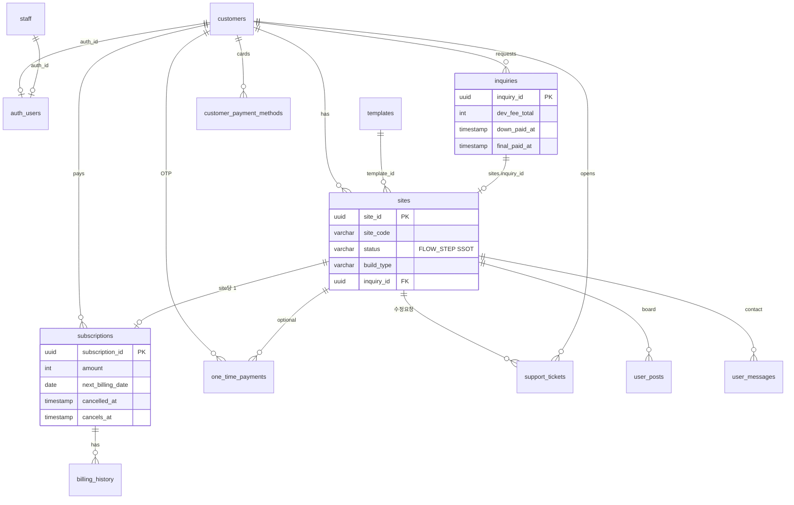

# ERD — 테이블 관계

작성일: 2026-09-19  
관련: [테이블명세](테이블명세.md) · [플로우](../플로우.md)

---

## 도식

---

## 관계

| 부모 | 자식 | FK |
|------|------|-----|
| customers | sites | sites.customer_id |
| templates | sites | sites.template_id |
| inquiries | sites | sites.inquiry_id |
| customers | inquiries | inquiries.customer_id |
| sites | subscriptions | subscriptions.site_id (UNIQUE) |
| subscriptions | billing_history | billing_history.subscription_id |
| sites | user_posts / user_messages / support_tickets | site_id |

---

## 주체

- **customers** = 고객(사장님)
- **staff** = 직원(본사)
- **user_*** = 방문자(공개 사이트)
