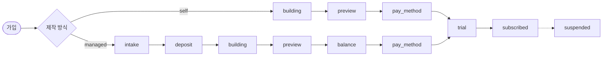

# 플로우 (LOGIC / FLOW)

작성일: 2026-09-19  
관련: [테이블명세](db/테이블명세.md) · [ERD](db/ERD.md)

---

## SSOT

**진도 · 공개 · 체험 · 구독 · 정지 = `sites.status` (FLOW_STEP) 하나.**

| 역할 | 테이블 | 비고 |
|------|--------|------|
| 진도·공개·체험/구독/정지 | `sites.status` | FLOW 코드만 |
| 견적·납부일 | `inquiries` | `dev_fee_total`, `down_paid_at`, `final_paid_at` |
| 1회성 결제 | `one_time_payments` | unpaid / pending_confirm / paid |
| 월 청구·해지 일정 | `subscriptions` | 금액·청구일·`cancelled_at` — **status 컬럼 없음** |

삭제된 컬럼: `deploy_status` · `inquiries.status` · `subscriptions.status` (migration 016)

---

## FLOW_STEP

코드: `lib/flow-step.js` · 라벨: `common_codes` (`group_code=FLOW_STEP`)

| code | 라벨 | 대리 | 셀프 |
|------|------|:----:|:----:|
| intake | 대리제작접수 | ○ | — |
| deposit | 선금 | ○ | — |
| building | 제작 | ○ | ○ |
| preview | 검토 | ○ | ○ |
| balance | 잔금 | ○ | — |
| pay_method | 카드/계좌 등록 | ○ | ○ |
| trial | 체험 | ○ | ○ |
| subscribed | 구독 | ○ | ○ |
| suspended | 정지 | ○ | ○ |

---

## 공개 범위

| FLOW | 공개 |
|------|------|
| intake · deposit · building | 제작하는 사람만 (대리=본사 · 셀프=사장님) + **본사는 항상 열람** |
| preview · balance | 부분공개 (본사+고객) |
| pay_method · trial · subscribed | 공개 |
| suspended | 미공개 |

구현: `lib/site-visibility.js`

---

## 정방향 (필드)

| 시점 | sites.status | inquiries / 기타 |
|------|--------------|------------------|
| 대리 접수 | intake | inquiry insert |
| 견적 | deposit | `dev_fee_total` + OTP 선금·잔금 2행(unpaid) |
| 선금 확인 | building | `down_paid_at` · OTP(down) paid |
| 검수 공개 | preview | — |
| 잔금 확인요청 | balance | OTP(final) `pending_confirm` |
| 잔금 확인 | pay_method | `final_paid_at` · OTP(final) paid |
| 서비스 시작 | trial | sub 행 + `trial_*` |
| 유료 확정 | subscribed | — |
| 정지·해지완료 | suspended | `cancelled_at` |

청구 대상: `sites.status` ∈ trial\|subscribed **그리고** `cancelled_at` IS NULL  
(`lib/subscription-life.js` · `lib/billing-batch.js`)

---

## 코드 경로

| | |
|--|--|
| FLOW | `lib/flow-step.js` · `lib/site-flow.js` |
| 공개 | `lib/site-visibility.js` |
| 대리 게이트 | `lib/managed-flow.js` |
| 서비스 시작 | `lib/deploy.js` |
| 본사 / 고객 | `app/platform` · `app/my` |

플로우 변경 시: `.cursor/rules/flow-change-checklist.mdc`
