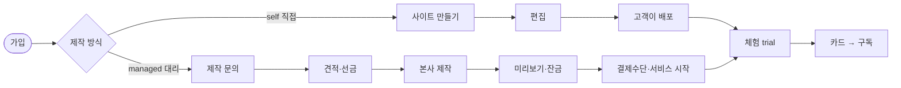
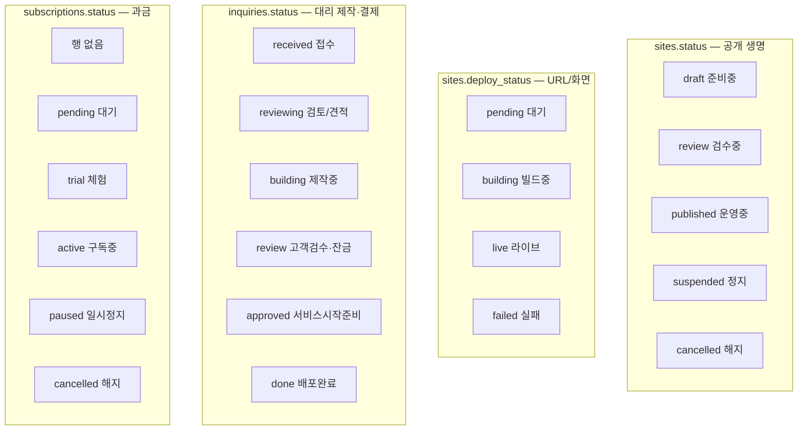
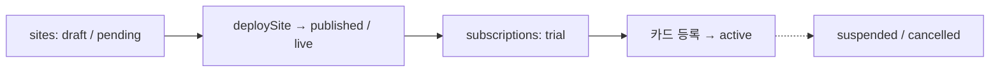
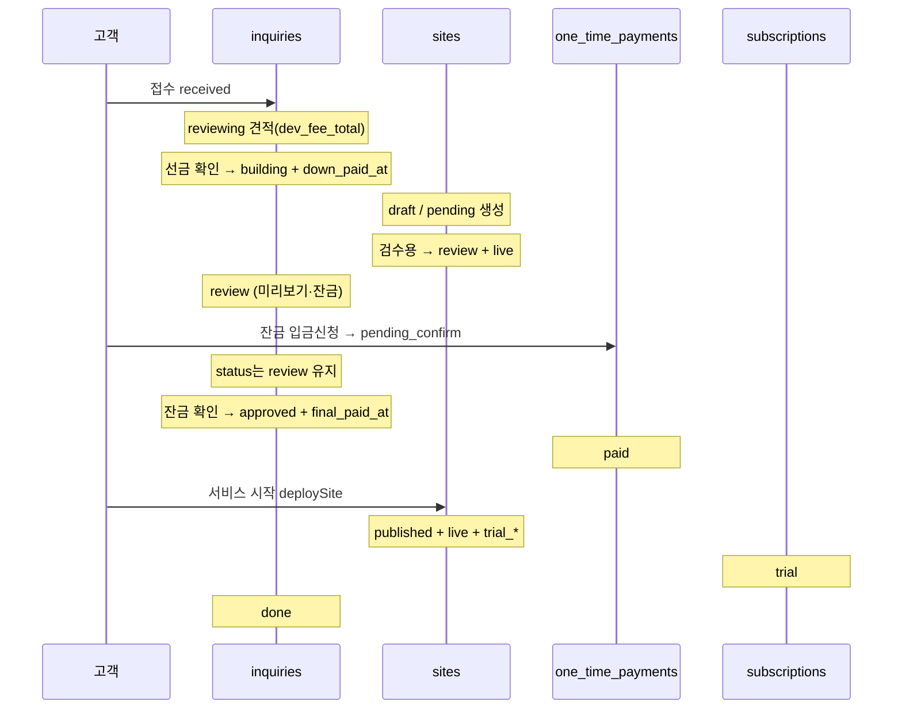
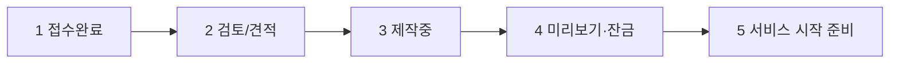
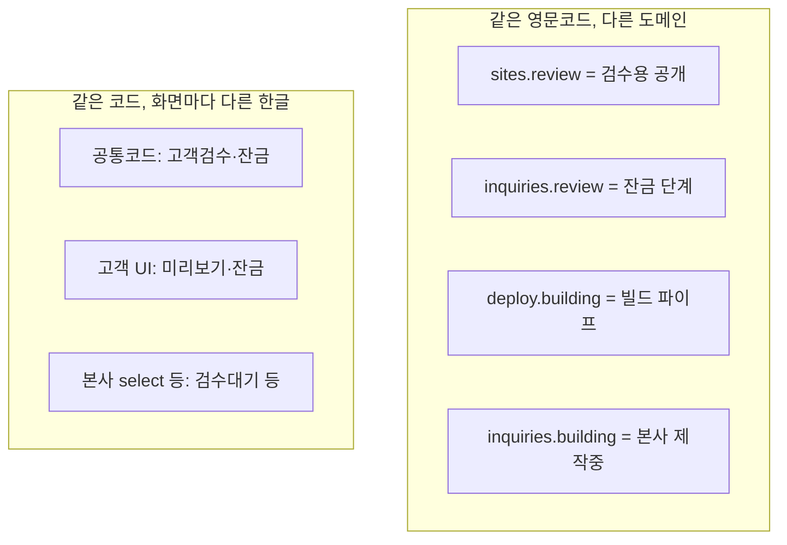

# 현재 플로우 도식 (AS-IS)

작성일: 2026-09-15  
범위: 코드·공통코드 기준 현행 (`SITE_STATUS` / `DEPLOY_STATUS` / `INQUIRY_STATUS` / `SUB_STATUS`)

> Cursor·GitHub 등에서 Mermaid가 지원되면 아래 코드블록이 **도식**으로 보입니다.  
> 미리보기가 안 되면 그대로 텍스트 흐름도로 읽으면 됩니다.

---

## 1. 큰 그림 — self / managed

- **self**: 문의(`inquiries`) 없음. 사이트·구독만.
- **managed**: 문의(제작·결제 진도) + 사이트 + (시작 후) 구독.

---

## 2. 상태 축 4개 (합치지 않는 이유)

| 축 | 질문에 답하는 것 |
|----|------------------|
| `SITE_STATUS` | 방문자가 사이트를 어떻게 보나? |
| `DEPLOY_STATUS` | 배포/공개 URL이 떠 있나? (검수 중에도 `live` 가능) |
| `INQUIRY_STATUS` | 선금·제작·잔금이 어디쯤인가? (managed만) |
| `SUB_STATUS` | 체험/유료/정지인가? |

---

## 3. 루트 A — 직접 제작 (self)

고객 `/my`에 문의 위저드 없음. 본사 상세의 self 스테퍼는 UI 전용(`draft → live → active → suspended`).

---

## 4. 루트 B — 본사 대리 (managed) 시간순

### 단계별 필드 (정방향)

| 시점 | inquiries | sites | OTP(dev_fee) | subscriptions |
|------|-----------|-------|--------------|---------------|
| 접수 | `received` | (없을 수 있음) | — | — |
| 견적 | `reviewing` | — | — | — |
| 선금 후 제작 | `building` + `down_paid_at` | `draft` / `pending` | — | — |
| 미리보기 | `review` | `review` / `live` | — | — |
| 잔금 신청 | `review` | (유지) | `pending_confirm` | — |
| 잔금 확인 | `approved` + `final_paid_at` | (유지) | `paid` | — |
| 서비스 시작 | `done` | `published` / `live` | — | `trial` |

게이트: `final_paid_at` + `status === 'approved'` 일 때 서비스 시작 가능 (`lib/managed-flow.js`).

---

## 5. 고객에게 보이는 문의 스텝 (위저드)

코드: `INQUIRY_CUSTOMER_STEPS` (`lib/payment/one-time.js`)  
공통코드 `done`은 위저드에 없고, `done`이면 `/my` 문의 카드 숨김.

실무 체감은 대략 4칸에 가깝다: `접수·견적 → 제작 → 미리보기·잔금 → 시작·운영`.

---

## 6. 이름·라벨이 헷갈리는 지점

프로세스가 길이로만 복잡한 것이 아니라, **축이 여러 개 + 라벨 소스 분산**이 겹친다.

---

## 7. 관련 파일

| 구분 | 경로 |
|------|------|
| 공통코드 시드 | `docs/db/sql/migrations/011_common_codes.sql` |
| 게이트 | `lib/managed-flow.js` |
| 배포·서비스 시작 | `lib/deploy.js` |
| 고객 문의 스텝 | `lib/payment/one-time.js` |
| 고객 `/my` | `app/my/page.js` |
| 본사 콘솔 | `app/platform/page.js` |
| 사이트 상세 스테퍼 | `components/PlatformSiteDetail.js` |
| DevTools 프리셋 | `components/PlatformDevTools.js` |

---

## 8. 참고 (개선 방향 — 미적용)

- DB 축(사이트/배포/문의/구독) **통합은 비추천**
- 고객 **표시 스텝 압축·라벨 통일**이 심플화 ROI 큼
- 이 문서는 **현재(AS-IS)** 기준. TO-BE를 정하면 별도 파일로 추가

---

## 9. 메인 플로우 TO-BE (`FLOW_STEP`) — 2026-09-17 확정

코드: `lib/flow-step.js` · 시드: `docs/db/sql/migrations/013_flow_step.sql`  
견적 = `deposit`(선금)에 포함. 셀프는 아래 ○만 표시.

| code | label | 대리 | 셀프 |
|------|--------|:----:|:----:|
| `intake` | 대리제작접수 | ○ | — |
| `deposit` | 선금 | ○ | — |
| `building` | 제작 | ○ | ○ |
| `done_build` | 완료 | ○ | ○ |
| `preview` | 검토 | ○ | — |
| `balance` | 잔금 | ○ | — |
| `pay_method` | 카드/계좌 등록 | ○ | ○ |
| `trial` | 체험 | ○ | ○ |
| `subscribed` | 구독 | ○ | ○ |
| `suspended` | 정지 | ○ | ○ |

UI 전면 교체·기존 inquiries.status 매핑은 후속 작업.
